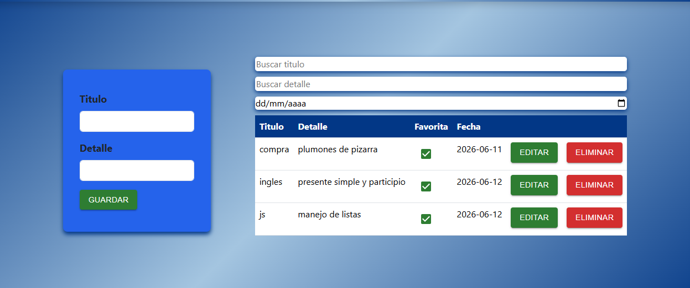

# 📝 Gestor de Notas



Aplicación web desarrollada con **React** para la gestión de notas personales. Permite crear, editar, eliminar, buscar y almacenar notas de forma persistente utilizando **Local Storage**.

---

## 🚀 Características

* ✅ Crear nuevas notas.
* ✏️ Editar notas existentes.
* 🗑️ Eliminar notas.
* ⭐ Marcar notas como favoritas.
* 🔍 Buscar por título.
* 🔍 Buscar por detalle.
* 📅 Filtrar por fecha.
* 💾 Persistencia de datos mediante Local Storage.
* 🧩 Arquitectura basada en componentes y hooks personalizados.

---

## 🛠️ Tecnologías utilizadas

* React
* JavaScript (ES6+)
* CSS3
* Material UI
* useState
* useEffect
* useReducer
* Hooks personalizados
* Local Storage

---

## ⚙️ Instalación

Clonar el repositorio:

```bash
git clone URL_DEL_REPOSITORIO
```

Ingresar al proyecto:

```bash
cd nombre-del-proyecto
```

Instalar dependencias:

```bash
npm install
```

Ejecutar el proyecto:

```bash
npm run dev
```

---

## 🎯 Objetivo del proyecto

Este proyecto fue desarrollado con el objetivo de fortalecer conocimientos en React, aplicando conceptos como:

* Componentización.
* Hooks personalizados.
* Manejo de estado con useReducer.
* Persistencia con Local Storage.
* Comunicación mediante props.
* Organización modular del código.

---


## 🌐 Demo

[Próximamente disponible en Netlify.](https://gestor-notas-react.netlify.app)

---

## 👨‍💻 Autor

Desarrollado por **Abel Pareja**.
